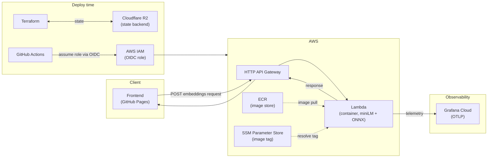

## Frontend for Embedding Visualizer
The embedding visualizer is a small tool to visualize semantic similarity of sentences or words to each other, using cosine similarity. For more details, see the [container](https://github.com/ziHanDing579/embedDocker) and the [terraform IaC](https://github.com/ziHanDing579/embedLambda). The live site is at [zihanding579.github.io/embed-visual](https://zihanding579.github.io/embed-visual/). You can see the Grafana dashboard [here](https://robustgodwit1873.grafana.net/public-dashboards/ab15358d87b1444896a161c0a517ed65).

This repo contains the front end.

### Created via Claude Opus 4.8
There were two objectives to the project when I started on it - Number one, create an embedding visualizer to help show audiences unfamiliar with NLP concepts what embeddings are and how their relationships enable further analysis. Number two, use IaC to deploy the infrastructure needed for this project for reusability and ease of management.

The frontend itself was simply a platform to show embeddings. It does carry a few specific functions:
1. Calculates embedding cosine similarity to the two inputs of choice
2. Create a plot and place the point relative to the cosine similarity

I have put the more interesting documentation regarding architecture and container in their respective repos: [container](https://github.com/ziHanDing579/embedDocker) and the [terraform IaC](https://github.com/ziHanDing579/embedLambda)

Here's the TLDR of the architecture:

